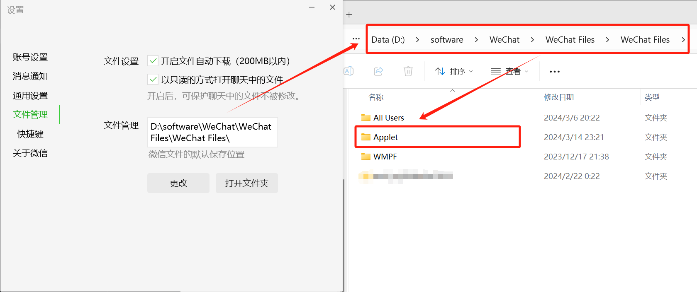
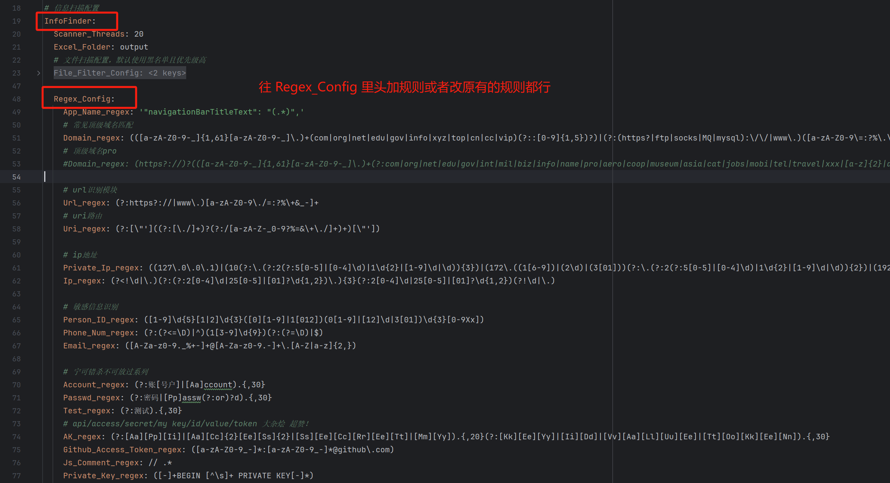

# wxApp-infoScanner

## 0x00 这干嘛用的啊？

1. 反编译小程序用的。
2. 扫描代码中的敏感信息用的。

## 0x01 emm...能帮我做啥？

1. 后台全自动流程：反编译小程序=>扫描源代码中的敏感信息=>未授权访问漏洞扫描。
2. 每扫描了一个小程序都会输出 对应源代码+敏感信息表
3. 根据扫描出的 ``url/uri`` 进行自动验活和扫一些基本的 未授权访问漏洞。

## 0x02 怎么用？

1. 先配置 config.yaml 中微信小程序存放的路径。

2. 然后安装项目需要的包。
`python -m pip install -r .\requirements.txt -i https://pypi.tuna.tsinghua.edu.cn/simple`
3. 执行命令启动。
`python .\main.py --mode mf`
4. 再打开小程序就行了。
5. 有演示视频。

## More
1. 你这正则写的不行，我要自己弄。
   config.yaml 里头有相关的配置，可以自己配

2. 怎么保证自动验活和扫描未授权访问漏洞时，不会扫到其他的域名和一些破坏性大的接口。
   答：内置了域名的黑名单，然后代码层加了个过滤函数，把一些带有 del 字眼的uri剔除掉。
3. 我就只是想单独用反编译的功能、扫描敏感信息的功能、只反编译和扫描一个小程序。
   答：`python .\main.py -h`
4. 

